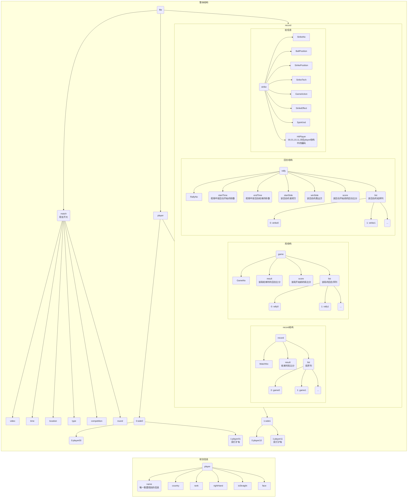

## 任务说明

[TOC]

### 任务目标

1. 实现一个基于统计的技战术分析系统
2. 熟悉了解乒乓球的数据格式
3. 熟悉了解乒乓球数据可视分析工具链

### 任务环境

1. 整体前端框架：React / Vue
2. 组件库：Material-UI / Ant-D
3. 数据中心：Redux / Vuex / 自己写
4. 后端：无 / HTTP请求flask后端数据

### 任务过程

1. 搭建React运行环境，系统使用中文；

2. 配置Redux或自己写一个Store

   store的作用在于，在前端建立一个组件之间数据中心。如果不使用store，组件之间的通信只能通过父子关系，一层层地传递。在一个实用项目中，组件树是较为庞大的，一层层地传递数据、事件非常麻烦。

   所以诞生了store，它可以和每一个组件建立联系。因此每一个组件只需要从store中读取数据，将事件传回store处理。store的数据更新之后，会通知使用了该数据组件更新渲染。

   Redux是React中store的一种实现。但由于这个库封装了很多的东西，初期学习成本较高。所以我推荐自己写一个store，这个store应该具有四个功能：

   1. 提供数据存储与数据处理
   2. 提供外部读取数据的接口（从系统架构的角度来说，最好不要把原数据暴露出去，外部不小心的修改，可能会导致整个系统崩溃。复制或重构一份传出的数据，可以保护store自身的稳定性）
   3. 提供外部修改数据的接口（一般是传入一个关键字和该关键字相关的参数）
   4. 提供数据修改后更新渲染

3. 实现读入多场比赛数据的功能

   使用`<input type='file' multiple='multiple'/>`，调用浏览器的文件选择窗口，读入数据。

4. 实现战术挖掘的算法

   该算法不唯一，建议自己先思考尝试，比较若干算法的复杂度。期间与我交流。

5. 实现筛选面板

   主要包括针对落点、身位、技术、势态、效果、旋转六个指标的勾选，勾选的属性，作为战术的核心属性。一个战术类当中所有的拍在核心属性上应当完全相同。

   针对比赛、局、回合、球员、战术使用率胜率等等的筛选。要考虑到新增的筛选方法，即筛选方法应当是留出增长空间的，如果提出一种新的筛选角度，最好能用最少的代码修改，实现筛选的功能。

6. 实现主页面的战术列表

   建议先画设计稿，再绘制。目前只要求在1920*1080的分辨率下显示正常。如果有能力，可以尝试不同分辨率下的显示，保证不出大问题。

7. 观察列表的单回合细节列表

   建议使用svg绘制。建议不使用d3绘制，直接使用react渲染。

8. 视频播放

   学习HTML5中video标签的相关使用方法。

9. 打磨提升

   在前述工作完成后，自己觉得哪里可以提高，自己实现相应的功能。

### 任务结果

该部分内容为必须实现的项目功能。括号内为该功能点考察的能力点。

1. 多场比赛的导入分析（文件选择API或网络通信）；
2. 快速的战术挖掘算法（算法、数据结构）；
3. 主页中的战术列表（组件库的使用）；
4. 观察列表中单回合细节列表（组件库与svg的使用）；
5. 筛选面板与筛选功能（组件库的使用、筛选功能模块的系统架构）;
6. 视频连续播放（HTML5中video的API）。

### 附录说明

### 链接

1. 原系统网址：47.102.124.6:8001
   需要导入.csv文件

#### 数据说明

原来系统使用的数据是.csv格式，新的系统需要使用.json格式。

数据格式制作树状图如下：

#### 指标明细

- BallPosition，落点

  | 数据 | 英文               | 中文       | 含义                     |
  | ---- | ------------------ | ---------- | ------------------------ |
  | S1   | Serve1             | 发球1      | 在反手区发球             |
  | S2   | Serve2             | 发球2      | 在正手区发球             |
  | BS   | Backhand Short     | 反手短球   | 接球前，球落在反手短球区 |
  | BH   | Backhand Half-long | 反手半长球 | 。。。                   |
  | BL   | Backhand Long      | 反手长球   | 。。。                   |
  | MS   | Middle Short       | 中路短球   | 。。。                   |
  | MH   | Middle Half-long   | 中路半长球 | 。。。                   |
  | ML   | Middle Long        | 中路长球   | 。。。                   |
  | FS   | Forehand Short     | 正手短球   | 。。。                   |
  | FH   | Forehand Half-long | 正手半长球 | 。。。                   |
  | FL   | Forehand Long      | 正手长球   | 。。。                   |
  | SP   | Special            | 意外球     | 球擦网或擦边             |

  落点示意图：

  

- StrikePosition：身位

  | 数据 | 英文      | 中文   | 含义                       |
  | ---- | --------- | ------ | -------------------------- |
  | S1   | Serve1    | 发球1  | 在反手区发球（和落点一样） |
  | S2   | Serve2    | 发球2  | 在正手区发球（和落点一样） |
  | P    | Pivot     | 侧身位 | 在反手区使用正手击球       |
  | B    | Backhand  | 反手位 | 在反手区使用反手击球       |
  | F    | Forehand  | 正手位 | 在正手区使用正手击球       |
  | T    | Back Turn | 反侧身 | 在正手区使用反手击球       |

  

- StrikeTech：技术

  | 数据       | 技术类别 | 英文              | 中文       |
  | ---------- | -------- | ----------------- | ---------- |
  | Pendulum   | 发球技术 |                   | 钟摆式发球 |
  | Reverse    | 发球技术 |                   | 逆旋转发球 |
  | Tomahawk   | 发球技术 |                   | 砍式发球   |
  | Topspin    | 进攻技术 |                   | 弧圈球     |
  | Attack     | 进攻技术 |                   | 快攻       |
  | Smash      | 进攻技术 |                   | 扣杀       |
  | Flick      | 进攻技术 |                   | 挑打       |
  | Twist      | 进攻技术 |                   | 拧         |
  | Push       | 控制技术 |                   | 搓球       |
  | Short      | 控制技术 | Touch Short       | 摆短       |
  | Slide      | 控制技术 |                   | 撇         |
  | Block      | 防守技术 |                   | 挡球       |
  | Lob        | 防守技术 |                   | 放高球     |
  | Chopping   | 防守技术 |                   | 削球       |
  | PimpleTech | 其他技术 | Pimpled Technique | 颗粒胶技术 |
  | Others     | 其他技术 |                   | 其他       |

- GameAction：势态

  | 数据       | 中文   | 含义                         |
  | ---------- | ------ | ---------------------------- |
  | Serve      | 发球   | 每回合第一拍                 |
  | Receive    | 接发球 | 每回合第二拍                 |
  | Stalemate  | 相持   | 以进攻技术回应进攻技术       |
  | Offensive  | 进攻   | 以进攻技术回应防守、控制技术 |
  | Defensive  | 防守   | 以防守技术回应进攻技术       |
  | Controlled | 控制   | 以控制技术回应控制技术       |

  注：

  - 进攻技术之后，不会使用控制技术，只能进攻或防守
  - 防守技术之后，不会使用防守、控制技术，只能进攻
  - 控制技术之后，不会使用防守技术，只能进攻或控制
  - 其他技术可以视为进攻、控制、防守中任意一种

- StrikeEffect：效果

  | 数据 | 英文    | 中文     | 含义                                     |
  | ---- | ------- | -------- | ---------------------------------------- |
  | L1   | Level 1 | 一级效果 | 击球后，对方马上输球                     |
  | L2   | Level 2 | 二级效果 | 击球后，取得优势（我方进攻，对方防守）   |
  | L3   | Level 3 | 三级效果 | 击球后，双方均势（互相进攻，或互相控制） |
  | L4   | Level 4 | 四级效果 | 击球后，去的劣势（对方进攻，我方防守）   |
  | L5   | Level 5 | 五级效果 | 击球后，我方马上输球                     |

  注：

  - 每一回合的最后一拍，必为输球方。所以最后一拍效果一定是5，倒数第二拍一定是1。

- SpinKind：旋转

  | 数据 | 英文                     | 中文   | 注                                 |
  | ---- | ------------------------ | ------ | ---------------------------------- |
  | ST   | **S**trong **T**opspin   | 强上旋 |                                    |
  | NT   | **N**ormal **T**opspin   | 中上旋 |                                    |
  | NS   | **N**o **S**pin          | 不旋转 |                                    |
  | ND   | **N**ormal **D**own-spin | 中下旋 |                                    |
  | SD   | **S**trong **D**own-spin | 强下旋 |                                    |
  | SK   | **S**in**k**             | 下沉   |                                    |
  | WT   | **W**ithout **T**ouch    | 未触球 | 最后一拍输球方，压根没碰到球的情况 |

  